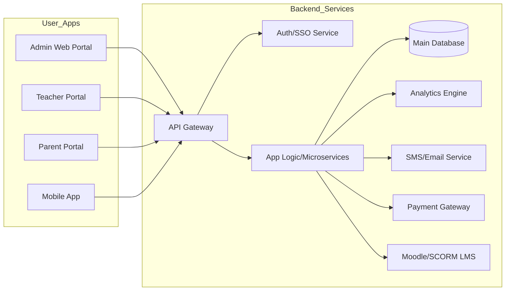
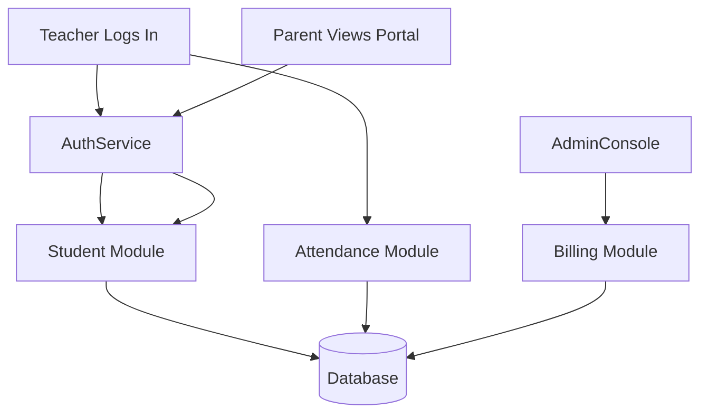

# School Management System – Product Requirements Document (Nigeria)  

## Executive Summary  
This PRD specifies a **comprehensive School Management System (SMS)** tailored for Nigerian schools, aligning with global best practices and national regulations. The system spans all core school operations: admissions, attendance, timetabling, grading/exams, curriculum mapping, finance (fees, payroll), parent/teacher/student portals, communications, analytics, and compliance/reporting. It enforces **data protection and accessibility** (NDPR/NDPA, WCAG 2.1) and supports modern UX (mobile-first, offline). Integrations include Nigerian payment/SMS gateways and exam board APIs. Deployment can be cloud or on-prem (Docker/Kubernetes). We benchmark against open-source solutions (Gibbon, RosarioSIS, etc.) and official Nigerian policies (FME’s ICT Digital Policy【53†L1370-L1379】【56†L1178-L1186】, NDPR【44†L350-L359】, NERDC curricula【69†L830-L834】). Success metrics include adoption rates, uptime (≥99.9%), and audit compliance. A phased roadmap (MVP, v1, v2) is proposed, with testing criteria and security controls (encryption, DPO appointment) to ensure a robust, scalable solution.  

## Scope, Goals, and Success Metrics  
- **Scope:** Covers K-12 and tertiary school administration (public/private), from student lifecycle to reporting and support services. Multi-tenant (district-wide) capability. No artificial constraints on budget or timeline (“no specific constraint”).  
- **Goals:** Improve operational efficiency, data visibility, and compliance. Enable digital learning continuity (e.g. remote/home schooling support). Enhance data-driven decision-making (analytics). Ensure data privacy by design.  
- **Success Metrics:**  System usage (100% of schools adopting core modules), reduced paperwork (>80% process digitization), SLA uptime ≥99.9%, NDPR audit compliance (no major breaches), satisfaction ratings from administrators/teachers/parents (>90% positive).  

## Functional Requirements  

- **Admissions & Enrollment:** 
  - *Features:* Online admission application, dynamic forms, document uploads (birth cert, prior transcripts), eligibility checks (age, prior grades).  
  - *Standards/Regulation:* Follow international SIS practice (automated admissions workflows) and Nigeria’s 6-3-3-4 education system policies. Integrate NERDC-approved criteria【69†L830-L834】.  
  - *Acceptance Criteria:* Validated student profile created with complete data; handles rejections/duplicates. Test: form submit with missing fields should error; duplicate application flagged.  
- **Attendance:** 
  - *Features:* Daily roll call (web/mobile), bulk entry (RFID/biometrics), tardiness tracking. Sync data offline. Automatic absence notifications to parents.  
  - *Standards:* Global practice (electronic roll-taking); Nigeria often reports attendance to UBEC.  
  - *Compliance:* Data logs for audits (NDPR logs).  
  - *Acceptance:* Marking all students per class registers; correct presence/absence tally. Test: teacher marks attendance for 30 students; system stores 30 records and updates dashboard.  
- **Timetabling:** 
  - *Features:* Define academic year/terms, classes, subjects, teachers, rooms. Automated conflict-free schedule generation; manual adjustments. Publish calendars to portals.  
  - *Standards:* Aligns with IMS scheduling guidelines; respects local norms (morning/afternoon sessions common in Nigeria).  
  - *Acceptance:* No teacher or room double-bookings. Test: assign Teacher A to two classes same time; system rejects conflict.  
- **Grading & Exams:** 
  - *Features:* Gradebook for assignments/tests, weighted grading, report card generation. Manage exam schedules, seating, hall tickets. Support continuous and exam-term grading.  
  - *Standards:* Follow IMS Learning Tools Interoperability (LTI) if linking with e-assessment tools. Import/export via SCORM or QTI formats.  
  - *Integration:* Connect to NECO/WAEC/JAMB for result verification (NECO e-Verify API available【62†L118-L121】).  
  - *Acceptance:* Calculated final grade accuracy (e.g. average of terms). Test: enter scores and verify weighted average matches syllabus rule.  
- **Curriculum Mapping:** 
  - *Features:* Tag subjects/topics to official curricula (NERDC’s 9-year Basic Education Curriculum【69†L830-L834】, Senior Secondary Curriculum). Track teacher lesson plans against standards.  
  - *Standards:* Align with NERDC and UBEC guidelines for content coverage.  
  - *Acceptance:* Curriculum coverage report per subject. Test: Map “Algebra” to NERDC JS1 objective; generating report shows alignment.  
- **Fee Management:** 
  - *Features:* Define fee categories (tuition, PTA, exam). Issue invoices, record payments, and generate receipts. Allow installment plans. Automated late fee calculations.  
  - *Standards:* Globally follows ERP billing.  
  - *Integrations:* Connect to Nigerian payment gateways (Flutterwave, Paystack, Interswitch, Remita)【62†L75-L84】. Generate Remita RRR for offline payments. Support Naira currency.  
  - *Acceptance:* Correct outstanding balance update after payment. Test: Issue ₦50,000 invoice, record ₦30,000 payment; system shows ₦20,000 due.  
- **HR & Payroll:** 
  - *Features:* Staff records (personal info, qualifications, roles). Leave management. Monthly payroll with statutory deductions (Pension, PAYE), print pay slips.  
  - *Standards:* Use Nigeria’s tax rules (Integrated Payroll & Personnel Information System - IPPIS compatible). Comply with FIRS, NHIF etc.  
  - *Acceptance:* Accurate net salary calculation. Test: Add staff with salary ₦100k, allowances ₦10k, apply 10% pension and 7.5% tax; system computes net correctly.  
- **Portals (Parent/Teacher/Student):** 
  - *Features:* Role-based login. Parents view child’s attendance/grades/fee status; teachers manage class activities; students access assignments/timetables. Two-way messaging.  
  - *Standards:* Responsive design (mobile-first). Align with modern EdTech UX.  
  - *Localization:* Support English and major Nigerian languages (Hausa, Yoruba, Igbo) for UI.  
  - *Acceptance:* Parent logs in and sees only own child’s data. Test: Parent A tries to access Parent B’s student – access denied.  
- **Communications:** 
  - *Features:* Bulk SMS, email notices, push notifications. Automate alerts (fee due, exam reminders). WhatsApp integration optional (via API).  
  - *Standards:* Use APIs (Termii, Africa’s Talking, Twilio). Maintain opt-in/out compliance.  
  - *Acceptance:* SMS delivered to provided numbers. Test: Trigger fee due alert; verify SMS received by stakeholder.  
- **Analytics & BI:** 
  - *Features:* Dashboards (enrollment trends, exam performance, financial overview). Custom report builder. Data export (CSV, Excel).  
  - *Standards:* Data visualization per best practices (charts, pivot tables). Meta-data tagging standards (Dublin Core) as per NDLP【56†L1178-L1186】.  
  - *Acceptance:* Reports generate under 5s for datasets <10k entries. Test: Run “Attendance report” query, confirm correct chart.  
- **Compliance & Reporting:** 
  - *Features:* Standardized reports for government (UBEC, NERDC). Policy compliance checklists (safety drills, accreditation).  
  - *Standards:* Follow national policies (e.g. School-Based Management). Data retention per NDPR (e.g. securely delete after retention period).  
  - *Acceptance:* Generate “Annual School Census” form. Test: Populate required fields and export PDF for UBEC format.  
- **Security & Backups:** 
  - *Features:* Role-based Access Control (RBAC), audit logs, SSL/TLS encryption. Periodic automated backups (encrypted, offsite). Multi-factor auth for admin.  
  - *Standards:* OWASP Top 10 mitigation; NDPR Sec 2.6 requires encryption and secure storage【44†L350-L359】. GDPR-like protections (data minimization, consent).  
  - *Compliance:* Appoint Data Protection Officer (DPO); register with NDPC; conduct Privacy Impact Assessments.  
  - *Acceptance:* Penetration test passes with no critical findings. Test: Attempt SQL injection on login – no breach.  

## Non-Functional Requirements  

- **Scalability & Performance:**  
  - *Description:* Scale horizontally (load-balanced web/app servers, clustered DB). Target response time <2s under peak load. Supports thousands of concurrent users.  
  - *Standards:* Use ISO/IEC 25010 quality characteristics (efficiency, reliability). Performance tests (JMeter) must meet SLAs.  
- **Localization:**  
  - *Description:* Interface supports WAT (UTC+1) timezone, ₦ (Naira) currency, date format DD/MM/YYYY. Multi-language UI (English + Hausa, Igbo, Yoruba).  
  - *Regulation:* Align with Federal Ministry’s National Language Policy (NERDC) and inclusive education mandates【69†L830-L834】.  
- **Accessibility:**  
  - *Description:* Comply with WCAG 2.1 AA (text alternatives, keyboard navigation, color contrast). Include closed captions on videos.  
  - *Standards:* UNCRPD and UNESCO ICT procurement guidelines emphasize accessible systems.  
- **Data Protection & Privacy:**  
  - *Description:* All personal data handled per NDPR 2019 and NDPA 2023. Implement user consent flows, data subject rights (access/deletion). Data at rest encrypted (AES-256) and in transit (TLS).  
  - *Regulation:* Align with Nigeria Data Protection Regulation (NDPR)【44†L350-L359】 and NDPC guidance. For example, NDPR mandates “data encryption technologies” and continuous staff training【44†L350-L359】.  
- **Reliability & Availability:**  
  - *Description:* 99.9% uptime (cloud HA or clustered on-prem). Disaster recovery plan: RTO <4h, daily backups.  
  - *Metrics:* MTBF (Mean Time Between Failures) > 3 months. SLA includes <1h support response for critical incidents.  
- **Maintainability:**  
  - *Description:* Modular codebase (microservices or well-layered monolith). Use containerization (Docker, Kubernetes) for easy updates.  
  - *Standards:* Follow Agile DevOps (CI/CD). Maintain a 95% test coverage and code reviews.  

## Standards & Regulatory Mapping  

Each requirement follows global best practices and Nigerian mandates:  
- **Privacy/Security:** Globally use GDPR/ISO 27001 principles; Nigeria’s NDPR requires encryption, breach notifications, and assigns heavy fines for non-compliance【44†L350-L359】. The NDPC actively audits schools (noting very low compliance【71†L128-L136】). Thus, we embed privacy-by-design and have a dedicated DPO and NDPA compliance plan.  
- **Accessibility:** Conform to WCAG 2.1 (UN and UNESCO guidelines). Nigeria’s Persons with Disabilities Act implies inclusive design.  
- **Data Standards:** Use standard data schemas (e.g. IMS Global’s specifications, SCORM 2004 for e-learning). NDLP encourages open standards (SQL, REST APIs, open-source components)【56†L1178-L1186】.  
- **Curriculum:** Align with NERDC/FG curricula; the Ministry’s policy rollouts (e.g. the Adapted 9-Year BEC【69†L830-L834】) guide the subject mapping module.  
- **Financial:** PCI-DSS for online payments; comply with CBN/NIBSS guidelines.  
- **Identity:** Support OAuth2/OpenID Connect or SAML (Google, Microsoft SSO). The NDLP calls for a national student digital ID (eNIN) system【55†L1712-L1720】.  
- **Interoperability:** Export/import via CSV/JSON and integrate with LDAP/Active Directory.  
- **Governance:** Use ISO/IEC/IEEE 42001 (“Educational technology management systems” under development) and NFPA (Nigeria’s e-government standards) as references.  

## Integrations  

- **Payment Gateways:** Flutterwave, Paystack, Interswitch, Remita. (NECO’s portal already uses Remita RRR)【62†L75-L84】. Plan for webhooks for payment status.  
- **SMS/Telecom:** Termii, Africa’s Talking, Twilio (global). Possibly API integrations with MTN/Airtel bulk SMS.  
- **Exam Boards:** NECO e-Verify API【62†L118-L121】; WAEC’s result-check (no public API known); JAMB’s centralized UTME data (if partnerships allow). Provide manual upload if no API.  
- **LMS/Content:** Moodle (LMS) via LTI/SCORM. Support SCORM 1.2/2004 packages import. Align with IEEE LOM/Dublin Core metadata for content【56†L1178-L1186】.  
- **SSO/Identity:** OAuth2/OIDC for Google Workspace/Microsoft accounts; optional CAS/SAML for school federation. LDAP integration for existing school networks.  
- **Others:** Single Sign-On with NIMC (future eNIN)【55†L1712-L1720】; potential API to Nigeria Immigration Service for student ID verification if available.  

## Deployment Options  

- **Cloud:** AWS/Azure/Google Cloud in Central Africa (for low latency). Offer SaaS multi-tenant. Use managed DB (RDS) for easier scaling.  
- **On-Premise:** Docker/Kubernetes on school servers (private cloud). Useful for national security cases (data residency).  
- **Hybrid:** Edge servers (for caching/offline sync in remote branches) + central cloud.  
- **Containerization:** Use Docker for stateless services. Kubernetes (or Docker Swarm) for orchestration, auto-scaling.  
- **DevOps:** CI/CD pipeline (GitHub Actions or GitLab CI) for automated testing/deployment. Infrastructure-as-Code (Terraform/Ansible) for repeatable setups.  

## Suggested Tech Stack  

- **Backend:** PHP (Laravel) or Node.js (Express) or Python (Django). PHP Laravel chosen for many existing SIS (Gibbon, UnivOfAbuja SMS) and local expertise.  
- **Frontend:** React or Vue.js (SPA) for portal UI, Bootstrap/Tailwind for styling. Mobile app: React Native or Flutter for cross-platform.  
- **Database:** PostgreSQL or MariaDB. For multi-tenancy, PostgreSQL with schema separation or row-level `school_id`. Elasticsearch for search analytics.  
- **Cache/Queue:** Redis for caching sessions, RabbitMQ or Kafka for background jobs (notifications, reports).  
- **Reporting/Analytics:** Use a BI tool (Metabase, Superset) or integrate with OLAP cubes.  
- **CI/CD:** GitHub/GitLab, with automated linting, unit tests, Selenium/Cypress end-to-end tests.  
- **Infrastructure:** NGINX or HAProxy as load balancer. SSL from Let’s Encrypt.  

## Acceptance Criteria & Test Cases  

- **Admissions:** Criteria: Complete student record created. *Test:* Submit minimal valid application; record in DB. *Test:* Omit required field; expect validation error.  
- **Attendance:** Criteria: Accurate attendance log per session. *Test:* Mark 10 students present/absent; verify report count =10.  
- **Timetabling:** Criteria: No schedule conflicts. *Test:* Assign teacher to overlapping classes; system blocks conflict.  
- **Grading:** Criteria: Correct grade calculation. *Test:* Input scores 80,90,70; check final grade average.  
- **Fees:** Criteria: Financial ledger balanced. *Test:* Generate invoice, apply payment, confirm balance update and receipt issuance.  
- **HR/Payroll:** Criteria: Statutory deductions applied. *Test:* Run payroll and validate tax/PFA vs manual calculation.  
- **Portal Access:** Criteria: Role-based view. *Test:* Teacher sees class list, parent only own child; access forbidden otherwise.  
- **Communications:** Criteria: Notifications delivered. *Test:* Trigger SMS alert; confirm receipt on test number.  
- **Analytics:** Criteria: Dashboards display expected data. *Test:* Create sample data set and verify chart values.  
- **Compliance:** Criteria: Reports match regulatory format. *Test:* Generate UBEC form; verify required fields present.  
- **Security:** Criteria: Data encrypted and audited. *Test:* Check database for plaintext PII; attempt SQL injection (should be blocked).  

## Security & Privacy Controls  

- **Data Protection Officer (DPO):** Appoint DPO per NDPR Article 1.27 (entities with >1,000 records) and register with NDPC.  
- **NDPR/NDPA Compliance:** Publish privacy policy; get parental consent for minors; conduct regular DPIAs.  
- **Encryption & Storage:** Encrypt all sensitive fields (student IDs, contact info) and use encrypted backups. SSL/TLS everywhere.  
- **Access Control:** Enforce least privilege. Role-based permissions (Admin, Teacher, Accountant, Parent). Mandatory 2FA for admin-level accounts.  
- **Auditing & Monitoring:** Maintain tamper-evident logs (who accessed/modified records). Use SIEM for anomaly detection. NDPC has begun auditing schools【71†L128-L136】.  
- **Training & Awareness:** Provide staff training (NDPC VPA courses offered)【71†L144-L147】. Include “Data Privacy Clubs” in schools as per NDPC recommendation.  
- **Incident Response:** Document breach plan; NDPR requires notifying NDPC within 72h of a breach. Conduct annual security drills.  

## Data Model & API Outline  

- **Key Entities:** Students, Staff, Classes, Sections, Sessions (Academic Year/Term), Fees/Invoices, Grades, Attendance, Messages, Users. Each table includes `school_id` for multi-tenancy and audit columns (created_by, timestamps).  
- **Schema Highlights:** 
  - *Students:* (id, first_name, last_name, gender, dob, class_id, session_id, school_id, parent_id, unique_national_id, etc.)  
  - *Staff:* (id, first_name, last_name, role, email, phone, salary, bank_details, school_id).  
  - *Classes:* (id, name, teacher_id, section_id, school_id).  
  - *Fees:* (id, student_id, amount, due_date, paid_amount, status, term_id, school_id).  
  - *Grades:* (id, student_id, subject, score, term, remarks, school_id).  
  - *Attendance:* (id, student_id, date, status, class_id, school_id).  
  - *Users:* (id, username, password_hash, role, related_person_id (student/staff), school_id).  
- **API Endpoints (REST):**  
  - `GET /api/students`, `POST /api/students`, `PUT /api/students/{id}`, `GET /api/students/{id}`, `DELETE /api/students/{id}` (CRUD for each entity).  
  - Similar for `/staff`, `/classes`, `/attendance`, `/grades`, `/fees`, etc.  
  - Auth endpoints: `POST /api/auth/login`, `POST /api/auth/refresh`.  
  - Analytics: `GET /api/reports/enrollment`, `/attendance-summary`.  
- **Sample GraphQL (optional):**  
  ```graphql
  type Query { students: [Student], student(id: ID!): Student }
  type Mutation { addStudent(input: StudentInput): Student }
  type Student { id: ID!, firstName: String!, lastName: String!, class: Class }
  ```  
- **API Security:** JWT tokens with role claims; rate limiting to prevent abuse. All APIs over HTTPS.  

## Architecture Diagrams (Mermaid)  





```mermaid
flowchart LR
  SchoolA[School A Users]
  SchoolB[School B Users]
  API[API Server (Multi-tenant)]
  Auth[Central Auth Service]
  SharedDB[(Shared DB with TenantID)]
  Reports[BI/Reporting]
  
  SchoolA --> API
  SchoolB --> API
  API --> Auth
  API --> SharedDB
  SharedDB --> Reports
```

## Phased Implementation Roadmap  

| Phase   | Features (MVP → v1 → v2)                             | Effort | Milestones                          | Risks & Mitigations               |
|---------|-------------------------------------------------------|--------|-------------------------------------|----------------------------------|
| **MVP** | Core modules: Student/Staff profiles, Admissions, Attendance, Classes/Sections, basic Timetable, Gradebook, Fee Invoicing, Parent Login (view only). | Medium | A1: Database & auth setup<br>A2: Student lifecycle (admit → assign class)<br>A3: Attendance & grading<br>A4: UI skeleton & APIs | *Scope creep* – Freeze features to must-haves.<br>*User buy-in* – Engage pilot school early. |
| **v1**  | Expand: Teacher/Parent portals, Exam scheduling, complete Fee/Payroll processing, SMS/email alerts, Reports & Dashboards, Mobile app alpha, Multi-school support (configurable school profiles). | Large  | B1: Teacher/Parent UI enhancements<br>B2: Integrate SMS gateway<br>B3: Exam/Result modules<br>B4: HR/Payroll workflow<br>B5: Data import from MVP | *Integration delays* – Use mock data/APIs for testing while partners onboard.<br>*Performance* – Conduct load testing and optimize queries. |
| **v2**  | Advanced: Offline mode (PWA caching, mobile sync), full curriculum module (NERDC mapping), AI tutoring module (optional), advanced BI (predictive analytics), SSO (OAuth/LDAP), full NDPR compliance audit & certification. | Large  | C1: Offline capabilities in mobile<br>C2: Complete curriculum engine<br>C3: NDPR third-party audit<br>C4: High-security hardening<br>C5: Training & rollout | *Technical debt* – Refactor code between phases.<br>*Compliance fines* – Early legal review, engage NDPC for advice (joint task force【71†L128-L136】). |

_Effort_ levels (Small/Medium/Large) are subjective: e.g. *Medium* = 3-6 months dev, *Large* = 6-12 months. 

## Code Reuse & Migration Strategy  

We evaluated several projects for reuse: Gibbon, RosarioSIS, Onyia314/school, Shalom-School-Manager, Univ-of-Abuja SMS. Below is a comparative table:

| Project (URL)                 | License     | Stack             | Stars/Updated   | Features                                   | Nigeria Fit                            | Notes (Start Point)                              |
|-------------------------------|-------------|-------------------|-----------------|--------------------------------------------|-----------------------------------------|---------------------------------------------------|
| **Gibbon**<br>gibbonedu.org【46†L193-L200】 | GPL-3.0     | PHP/MySQL         | 593★ (Mar’26)   | Attendance, timetabling, grades, billing, parent comms, discipline【18†L19-L23】 | Global; Nigeria usage (principal says “superb UI”【2†L149-L151】) | Feature-rich; plugin architecture; excellent docs. Good core to fork for fully-featured SMS. |
| **RosarioSIS**<br>rosariosis.org【18†L19-L23】 | GPL-2.0     | PHP/PostgreSQL    | 623★            | K–12 SIS: gradebook, attendance, scheduling, billing【18†L19-L23】; Moodle LMS integration【18†L35-L37】 | Widely used; multi-language; generic K-12 | Mature code; extend with Nigeria modules. Robust reporting. |
| **Onyia314/School**<br>GitHub【66†L331-L339】 | MIT (unlicensed) | PHP/Laravel       | 6★ (2020)       | Basic student/staff management, classes, sessions【66†L331-L339】 | Nigerian dev; Lagos timezone default【66†L331-L339】 | Laravel framework; simplistic. Could bootstrap custom solution but needs major development. |
| **Shalom-School-Manager**<br>GitHub【12†L296-L299】 | (GPL-3)     | PHP/Laravel       | 1★ (2022)       | Secondary school processes: exams module, fee handling | Built for Ebonyi secondary school【12†L296-L299】 | Codebase exists; add missing features. Lesser maintenance activity. |
| **UnivAbuja-SMS**<br>GitHub【14†L317-L324】   | (None given) | PHP/Laravel       | 7★ (2025)       | Univ admin: student/faculty, courses, analytics【14†L317-L324】 | Nigerian uni context; up-to-date Laravel 10 | Modern code, active. Good baseline for student/course management. |
| **Babatunde-School**<br>GitHub【3†L205-L208】  | (None)       | PHP/MySQL         | 6★ (2020)       | Simple CRUD for student records | Nigeria-oriented demo | Outdated/minimal. Use only as conceptual reference. |
| **Open School Mgmt (frier17)**<br>GitHub【5†L5-L13】 | (None)     | PHP/Laravel       | 1★ (2016)       | Conceptual docs (attendance, grades, parent portal) | Aimed at Nigeria but incomplete | No working code; skip as base. |

**Recommended Starting Point:** For fastest go-to-market, **fork Gibbon or RosarioSIS** and customize. They cover most modules and adhere to many global standards. Alternatively, use the *UnivAbuja-SMS* as a Laravel foundation if PHP is preferred (add missing modules). The table above rates "Nigeria Fit" and "Notes" to guide choices. 

## Operational Requirements  

- **Service Level (SLA):** 99.9% uptime guarantee. Support response: <1 hour (critical), <24h (normal). Monthly performance report.  
- **Backups & DR:** Automated daily backups (encrypted, geo-redundant). Test restores quarterly. Offsite (cloud) and optional on-prem tapes. RPO (data loss) < 1h, RTO < 4h.  
- **Monitoring:** 24/7 system health monitoring (server metrics, error logging). Use tools like Prometheus/Grafana or New Relic. Alert on failures or threshold breaches (e.g. CPU >80%).  
- **Support Model:** Tiered support: Level-1 (helpdesk via email/phone), Level-2 (technical support), Level-3 (dev escalation). Maintain documentation and FAQ. Monthly patch updates.  
- **Training:** Provide on-site/virtual training for admin users. Develop user manuals and video tutorials. Establish “super-users” in schools. NDPC recommends **Privacy Clubs** and awareness; incorporate privacy training for staff【71†L128-L136】.  

## Assumptions  

- *No Constraint:* Unlimited budget/timeline allows best tech and thorough QA.  
- *User Devices:* Assume widespread smartphone/internet use, but still design offline sync for remote areas.  
- *Data Migration:* Legacy records (paper or old systems) will be digitized.  
- *Integration Availability:* NECO/WAEC will grant API access as needed (else, fallback to manual CSV import).  
- *Staff Skill:* Basic computer literacy among school staff; training will cover new tech.  

## References & Sources  

- **Nigeria Digital Learning Policy (Ministry of Education, 2023):** Emphasizes secure, inclusive ICT in schools【53†L1370-L1379】【56†L1178-L1186】.  
- **Nigeria Data Protection Regulation (NDPR 2019, NITDA):** Governs all personal data processing【44†L350-L359】. Requires encryption, consent, DPO, heavy fines.  
- **NDPC (Data Protection Commission) News:** Low compliance in schools, NDPC/Ed Ministry task force on school data privacy【71†L128-L136】【71†L136-L142】.  
- **NERDC (Curriculum Council):** Official curriculum frameworks (e.g. 9-Year Basic Education Curriculum)【69†L830-L834】.  
- **NDPC Official Portal:** Resources on breaches, DPO registration (for procedures).  
- **Education.gov.ng / NERDC.gov.ng:** Policy documents and updates (Digital Literacy, curriculum).  
- **Open Source Projects:** Gibbon (gibbonedu.org), RosarioSIS (rosariosis.org), GitHub repos listed above.  
- **Exam Board Sites:** NECO e-Verify (everify.neco.gov.ng) for API use【62†L118-L121】.  

Further reading: Nigeria’s *National Policy on Education*, UNESCO reports on EMIS, and technical docs for LMS standards (SCORM, LTI). All sources are in English. 

